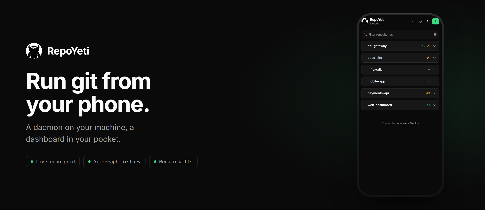
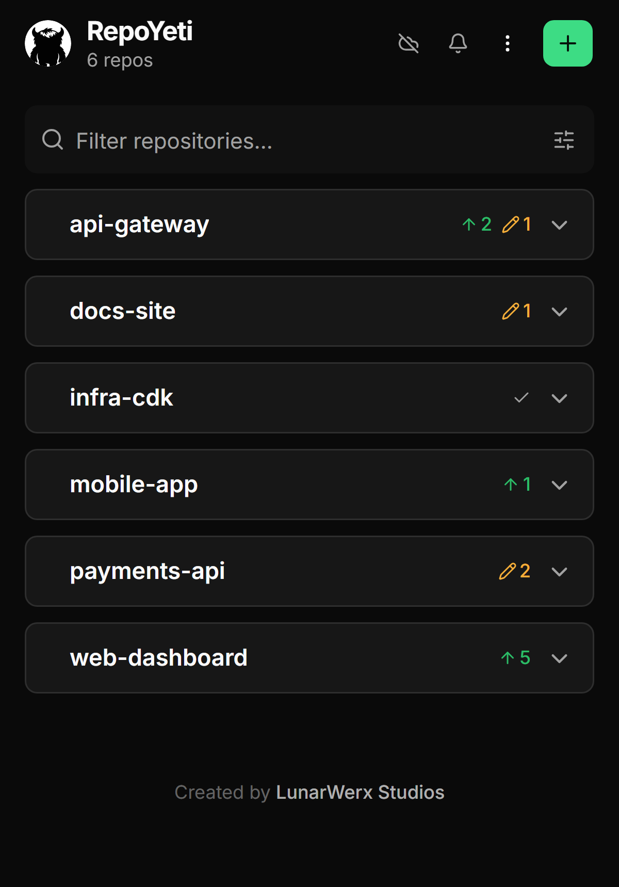
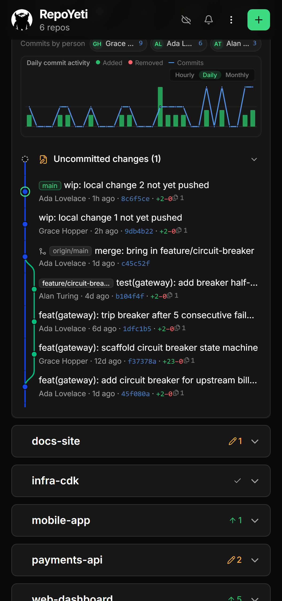
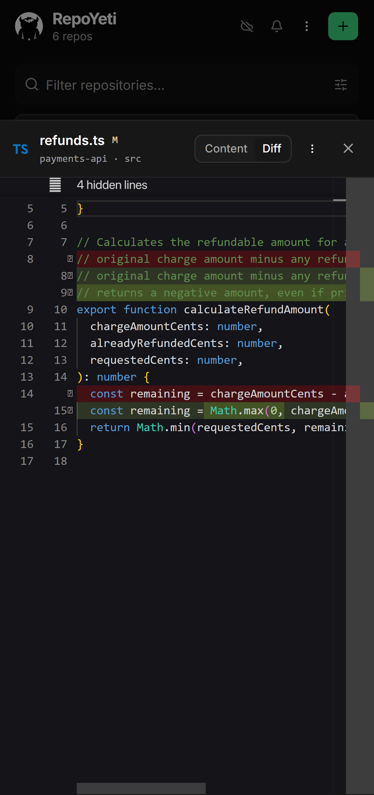
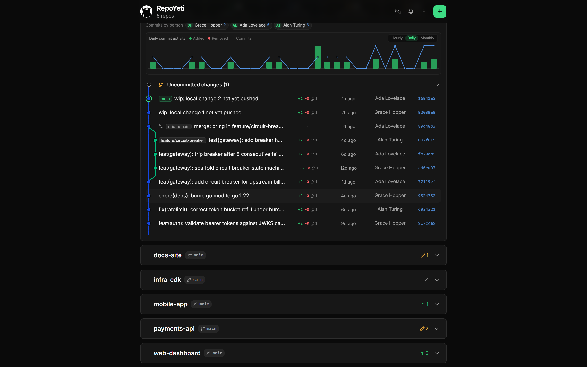
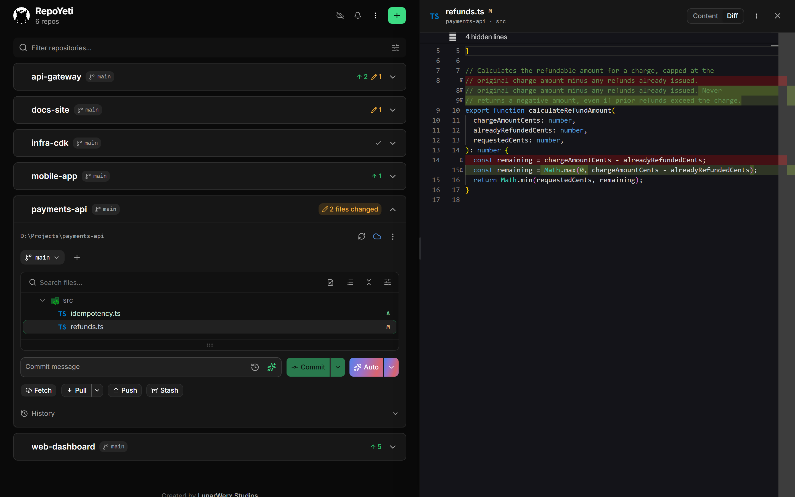

<div align="center">



<p>
  <a href="https://repoyeti.com"><b>repoyeti.com</b></a>
  &nbsp;·&nbsp; <a href="#quick-start">Quick start</a>
  &nbsp;·&nbsp; <a href="#what-you-get">Features</a>
  &nbsp;·&nbsp; <a href="https://github.com/LunarWerxs/RepoYeti/releases">Download</a>
  &nbsp;·&nbsp; <a href="CHANGELOG.md">Changelog</a>
</p>

<p>
  
  
  
  
</p>

</div>

---

RepoYeti runs a small daemon on your machine, finds every git repo you have, and serves a dashboard to your phone over a private tunnel. Fetch, commit, push, and read history and diffs from wherever you are. It runs on your machine, so your code stays there.

<!-- A table, not three loose  tags: GitHub collapses whitespace between images, so the
     phones ended up shoulder to shoulder. GitHub also sizes table columns to their content and
     drops most width/style attributes, so percentage widths do nothing. The gutters have to be
     real empty cells with a transparent spacer image holding them open. -->
<table align="center">
  <tr>
    <td align="center"></td>
    <td></td>
    <td align="center"></td>
    <td></td>
    <td align="center"></td>
  </tr>
  <tr>
    <td align="center"><sub>Every repo at a glance</sub></td>
    <td></td>
    <td align="center"><sub>Commit graph, lanes and merges</sub></td>
    <td></td>
    <td align="center"><sub>Real Monaco diffs</sub></td>
  </tr>
</table>

## What you get

- 📡 &nbsp;**Live repo grid.** Branch / dirty / ahead / behind for every repo, updated the moment it changes. Fetch all in one tap.
- 🌿 &nbsp;**Git-graph history.** The commit graph with lanes and merges, lazily paged, with each commit's files-and-lines delta. Drag it taller to read more of it at once.
- ☑️ &nbsp;**Bulk actions.** Select any number of repos and pin, star, hide or remove them in one go. Every action undoes.
- 👀 &nbsp;**Preview a pull.** See the incoming commits, the files they touch, and any conflicts they'd cause, before you pull. Nothing is fetched or merged by looking.
- 🔍 &nbsp;**Monaco diffs.** The real VS Code editor: syntax highlighting, HEAD-↔-tree diffs, edit and save.
- 🤖 &nbsp;**Smart Commit (AI).** Split a messy working tree into clean, scoped commits. Bring your own key.
- 🪪 &nbsp;**Per-repo identities.** The right git identity for each repo, no `--amend --author` afterthoughts.
- 🏠 &nbsp;**Self-hosted.** Nothing runs in someone else's cloud. Uninstall it and your repos are untouched.

<div align="center">
  
  <br /><sub>The same history, opened in a desktop browser</sub>
</div>

## Quick start

Grab your platform from [Releases](https://github.com/LunarWerxs/RepoYeti/releases): one file, no
runtime to install. On Windows that's `repoyeti-windows-x64.exe`; run it directly. The dashboard is
embedded in the executable, so there is no `web` or `node_modules` folder to keep beside it. The
one-file ZIP remains available for the automatic updater.

Want a system-tray icon? Take `repoyeti-windows-x64-with-tray.zip` instead, run
`misc\Create-Shortcut.ps1` once, and launch from the shortcut it creates. The icon is drawn by a
small separate launcher (`misc\lunarwerx-tray.exe`), so running `repoyeti.exe` on its own never
produces one.

```sh
repoyeti add-root ~/code   # point it at where your repos live
repoyeti start             # daemon on 127.0.0.1:7171
```

To reach it from your phone (opens a Cloudflare tunnel and prints a QR code):

```sh
repoyeti start --tunnel
```

Remote access needs [`cloudflared`](https://developers.cloudflare.com/cloudflare-one/connections/connect-networks/downloads/)
installed and on `PATH`; it is not bundled, in a release or a clone. Check with `cloudflared
--version`. If it is missing, RepoYeti says so and keeps serving locally.

Sign-in over a tunnel returns through RepoYeti's registered callback at `app.repoyeti.com`; your
dashboard and Git traffic never pass through it. See [Remote access](docs/STABLE_ADDRESS.md).

### Running from a clone

The repo has **two** dependency sets (the daemon's and the dashboard's), and the dashboard is
normally compiled into the release binary rather than committed, so a fresh clone has to build it
once. Without that step the daemon starts and serves `web app not built`.

```sh
git clone https://github.com/LunarWerxs/RepoYeti.git
cd RepoYeti

bun install                     # daemon deps
bun install --cwd web           # dashboard deps (separate package.json)
bun run --cwd web build:fast    # compile the dashboard into web/dist

bun run src/index.ts add-root ~/code
bun run src/index.ts start
```

You need [Bun](https://bun.com/docs/installation) ≥ 1.1 and `git` on `PATH`, plus `cloudflared` if
you want `--tunnel` (same as a release, see above).

## AI setup: a free Groq key in 3 clicks

Smart Commit and AI commit messages are bring-your-own-key (there's no bundled key, because Groq revokes any key committed to a public repo). Groq is the suggested provider: free, fast, ~30 seconds:

1. Open **[console.groq.com/keys](https://console.groq.com/keys)** and sign in.
2. Click **Create API Key**, then **Copy**.
3. In the app, open **Settings → AI**, expand **Groq**, and paste it in.

"Generate" lights up right away. Prefer OpenAI / Claude / Gemini / OpenRouter / DeepSeek? Add that key in the same place instead; your key never leaves the daemon (it's kept in your OS keychain).

<div align="center">
  
  <br /><sub>Real Monaco, side by side with the repo list</sub>
</div>

## The rules

No force-push, no `reset --hard`, no rebase. A phone is a lousy place to rewrite history, so those live at your desk. Pulls are fast-forward-only, and everything runs as the git identity you set for that repo. Local state stays in `~/.repoyeti/`; nothing is written into your repos.

## Built with

Bun · `bun:sqlite` · Hono · `simple-git` on the daemon, and a Vue 3 + Tailwind PWA on the front end. Sign-in is "Sign in with Connections" (OIDC / PKCE, zero setup). A pluggable VCS backend also supports [Lore](src/vcs/lore.ts) behind `REPOYETI_LORE=1`.

Cloud sign-in and settings sync are entirely optional and off by default; core git management works fully self-hosted and offline, no LunarWerx account required.

## More

- **AI agents (MCP):** `repoyeti mcp` exposes local repos plus accepted collaboration status/diffs and guarded remote commit+sync; the full HTTP surface is at `GET /api/openapi.json`.
- **Buzz (experimental, Advanced):** opt-in Git Smart HTTP compatibility, saved communities, and
  daemon-safe preflight diagnostics. [Setup and security boundaries](docs/BUZZ.md).
- **Architecture, remote access, config:** [docs/ARCHITECTURE.md](docs/ARCHITECTURE.md)
- **Contributing & tests:** [docs/CONTRIBUTING.md](docs/CONTRIBUTING.md)

## License

[MIT](LICENSE) © LunarWerx Studios. Bundled file-type icons are [`vscode-icons`](https://github.com/vscode-icons/vscode-icons) (icon artwork under CC BY-SA).
