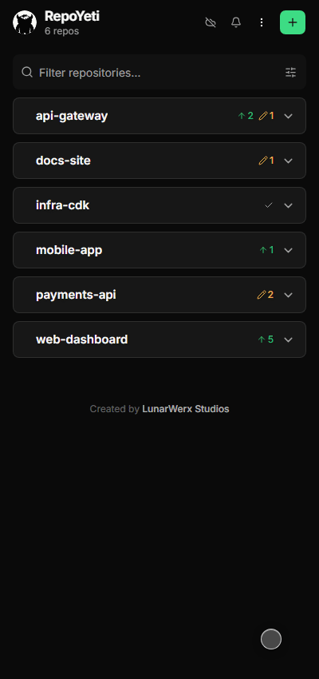

<div align="center">


### Every git repo on your machine, on your phone.

A self-hosted git dashboard: one small daemon on your computer, a live status grid, commit graph and real Monaco diffs on any screen you own.

[](https://github.com/LunarWerxs/RepoYeti/releases)
[](https://github.com/LunarWerxs/RepoYeti/actions)
[](#license)
[](#how-it-works)
[](#privacy)
[](https://discord.gg/PsWpeNUzhk)

[**⬇ Download**](https://github.com/LunarWerxs/RepoYeti/releases) · [repoyeti.com](https://repoyeti.com) · [Features](#features) · [Install](#install) · [FAQ](#faq) · [Changelog](CHANGELOG.md)

<br />

<!-- A table, not three loose  tags: GitHub collapses whitespace between images, so the
     phones ended up shoulder to shoulder. GitHub also sizes table columns to their content and
     drops most width/style attributes, so percentage widths do nothing. The gutters have to be
     real empty cells with a transparent spacer image holding them open. -->
<table align="center">
  <tr>
    <td align="center"></td>
    <td></td>
    <td align="center"></td>
    <td></td>
    <td align="center"></td>
  </tr>
  <tr>
    <td align="center"><sub>Every repo at a glance</sub></td>
    <td></td>
    <td align="center"><sub>Commit graph, lanes and merges</sub></td>
    <td></td>
    <td align="center"><sub>Real Monaco diffs</sub></td>
  </tr>
</table>

<br />



</div>

---

## TL;DR

- 📡 &nbsp;**Every repo on the machine, live.** Branch, dirty, ahead/behind for all of them, updating the moment something changes on disk. Fetch all in one tap.
- 🌿 &nbsp;**A real commit graph**, with lanes and merges, lazily paged, each commit carrying its files-and-lines delta. Drag it taller to read more at once.
- 🔍 &nbsp;**Real Monaco diffs**, the actual VS Code editor: syntax highlighting, HEAD-↔-tree comparison, edit and save from the phone.
- 👀 &nbsp;**Look before you pull.** The incoming commits, the files they touch and the conflicts they would cause, without fetching or merging anything.
- 🤖 &nbsp;**Smart Commit (AI)** turns a messy working tree into clean, scoped commits. Bring your own key; a free Groq one takes three clicks.
- 🛡️ &nbsp;**No force-push, no `reset --hard`, no rebase.** A phone is a bad place to rewrite history, so RepoYeti simply cannot.
- 🏠 &nbsp;**Self-hosted, one file.** No cloud account, no runtime to install, nothing written into your repos. Delete the binary and it is gone.

> **[Download for your platform →](https://github.com/LunarWerxs/RepoYeti/releases)** One file. Point it at a folder, open the QR code on your phone.

---

## Features

|  |  |
|---|---|
| 📡 **Live repo grid** | Every repository under your roots, with branch, dirty count, and ahead/behind. Driven by a filesystem watcher, so it reflects a commit you made in a terminal a second ago. **Fetch all** sweeps the set with per-repo progress and a Stop button |
| 🌿 **Git-graph history** | Lanes, merges and tags, paged lazily so a 40,000-commit repo opens as fast as a new one. Each commit shows its touched files and line delta; a commit-activity chart sits above it. Resizable, because a phone screen is short |
| 🔍 **Monaco diffs** | The real VS Code editor, not a re-implementation: syntax highlighting for everything it knows, side-by-side or inline, HEAD-↔-working-tree, and an editor you can save from |
| 👀 **Preview a pull** | See the incoming commits, the files they touch, and any conflicts they would cause **before** you pull. Nothing is fetched, nothing is merged, nothing is written by looking |
| 🤖 **Smart Commit (AI)** | Hands a messy working tree to your chosen model and gets back scoped commits with written messages, which you approve, edit or throw away. Also writes single commit messages and resolves conflicts. Groq, OpenAI, Claude, Gemini, OpenRouter and DeepSeek, under your own key |
| ☑️ **Bulk actions** | Select any number of repos and pin, star, hide or remove them at once. Every action undoes |
| 🪪 **Per-repo identities** | The right name and email per repository, applied at commit time, with rules that match by path. No more `--amend --author` the next morning |
| 🔐 **Per-repo accounts** | Multiple GitHub accounts, pinned per repository, so a push from the work repo uses the work credential and never silently uses the other one |
| 📱 **A real PWA** | Install it to the home screen. It reconnects after the phone sleeps, survives a backgrounded tab mid-operation, and asks the daemon what happened rather than spinning forever |
| 🌐 **Private tunnel** | `--tunnel` opens a Cloudflare tunnel and prints a QR code. Your dashboard and git traffic go through your own tunnel, not through us |
| 🤝 **Agents (MCP)** | `repoyeti mcp` exposes your repos to an AI agent with an approval gate on anything that mutates, so the agent asks before it commits. The full HTTP surface is at `GET /api/openapi.json` |
| 🛡️ **Safe by construction** | Force-push, `reset --hard` and rebase are not implemented, not hidden. Pulls are fast-forward-only and stop rather than merge when a branch has diverged |
| 🏠 **Self-hosted** | A single compiled binary with the dashboard inside it. Local state lives in `~/.repoyeti/`; your repositories are never written to except by the git commands you ask for |

<div align="center">
  
  <br /><sub>The same history, opened in a desktop browser</sub>
</div>

---

## One daemon, a whole workaround gone

Managing git on a machine you are not sitting at usually means assembling something: a VPN, an SSH client, a tmux session, a second git host. RepoYeti is one binary that makes the working tree you already have reachable from the device already in your hand.

| Instead of... | You already have it |
|---|---|
| **GitHub Desktop**, on a machine you are not at | A dashboard for **every** repo on that machine, opened from anywhere, in a browser |
| The **GitHub mobile app**, which browses github.com but never touches your working tree | Your actual local working tree: real status, real diffs, real commits |
| **Tailscale + SSH + tmux + vim** to commit one file | A tap, a Monaco diff, a commit message, done |
| Standing up a **self-hosted Gitea/Forgejo** just to see repo status remotely | No second git host, no mirroring, no second copy of anything to keep in sync |
| A **cron job that auto-commits** and hopes for the best | Auto-commit that you can watch, with a diff you can read first |
| Writing commit messages on a phone keyboard | **Smart Commit** writes them, you approve them |

Nothing is mirrored, uploaded, or re-hosted. RepoYeti shells out to the same `git` you already use, in the same working tree, as the identity you configured for that repository.

---

## ⭐ Like it? Help it grow

Built in the open, free for personal use, no ads and no telemetry beyond a once-a-day version check you can switch off. If RepoYeti earns a place on your machine, a few seconds goes a long way:

- ⭐ **[Star the repo](https://github.com/LunarWerxs/RepoYeti)** - the clearest signal that this is worth maintaining.
- 💬 **[Join the Discord](https://discord.gg/PsWpeNUzhk)** - feature arguments, early builds, and somewhere to shout when something breaks.
- 🐛 **[Open an issue](https://github.com/LunarWerxs/RepoYeti/issues)** - a good bug report is worth more than a star. [#24](https://github.com/LunarWerxs/RepoYeti/issues/24) traced a broken release to the exact commit and got two fixes shipped.

---

## Install

1. **[Download your platform](https://github.com/LunarWerxs/RepoYeti/releases)** - `repoyeti-windows-x64.exe`, `repoyeti-linux-x64.tar.gz` or `repoyeti-macos-arm64.tar.gz`.
2. Run it. The dashboard is compiled into the binary, so there is no `web` or `node_modules` folder to keep beside it.

```sh
repoyeti add-root ~/code   # point it at where your repos live
repoyeti start             # daemon on 127.0.0.1:7171
```

To reach it from your phone, which opens a Cloudflare tunnel and prints a QR code:

```sh
repoyeti start --tunnel
```

> **Want a tray icon?** Take `repoyeti-windows-x64-with-tray.zip` instead, run `misc\Create-Shortcut.ps1` once, and launch from the shortcut it creates. The icon is drawn by a small separate launcher (`misc\lunarwerx-tray.exe`), so running `repoyeti.exe` on its own never produces one.

> **Signed.** Starting with 1.0.1 the Windows executable, the tray launcher and the tray scripts are Authenticode-signed as **LUNARWERX LLC** through Azure Trusted Signing, and timestamped, so Windows names the publisher instead of warning about an unknown one. SmartScreen still rates new signing identities on reputation, so a very early download may show a prompt that now says who published it. Every release also publishes a `SHA256SUMS.txt`.

> **`--tunnel` needs [`cloudflared`](https://developers.cloudflare.com/cloudflare-one/connections/connect-networks/downloads/)** on `PATH`; it is not bundled, in a release or a clone. Check with `cloudflared --version`. If it is missing, RepoYeti says so and keeps serving locally. Sign-in over a tunnel returns through RepoYeti's registered callback at `app.repoyeti.com`; your dashboard and git traffic never pass through it. See [Remote access](docs/STABLE_ADDRESS.md).

### Release binary vs. running from a clone

|  | Release binary | Clone |
|---|---|---|
| Single file, nothing beside it | ✅ | ❌ (daemon deps + dashboard deps) |
| Dashboard already built in | ✅ | ❌ (`bun run --cwd web build:fast` once) |
| Automatic self-update | ✅ | ✅ (pulls and rebuilds) |
| Optional system-tray icon | ✅ (the `-with-tray` zip) | ❌ |
| Needs [Bun](https://bun.com/docs/installation) ≥ 1.1 installed | ❌ | ✅ |
| Edit the source and see it live | ❌ | ✅ |

```sh
git clone https://github.com/LunarWerxs/RepoYeti.git
cd RepoYeti

bun run install:all             # daemon deps + dashboard deps (web/ is a separate package)
bun run --cwd web build:fast    # compile the dashboard into web/dist

bun run src/index.ts add-root ~/code
bun run src/index.ts start
```

The repo has **two** dependency sets and the dashboard is compiled into the release rather than committed, so a fresh clone has to build it once. Without that step the daemon starts and serves `web app not built`.

---

## AI setup: a free Groq key in 3 clicks

Smart Commit and AI commit messages are bring-your-own-key. There is no bundled key, because Groq revokes any key committed to a public repo. Groq is the suggested provider: free, fast, about thirty seconds.

1. Open **[console.groq.com/keys](https://console.groq.com/keys)** and sign in.
2. Click **Create API Key**, then **Copy**.
3. In the app, open **Settings → AI**, expand **Groq**, and paste it in.

"Generate" lights up right away. Prefer OpenAI, Claude, Gemini, OpenRouter or DeepSeek? Add that key in the same place instead. Your key never leaves the daemon; it is kept in your OS keychain and sent only to the provider it belongs to.

<div align="center">
  
  <br /><sub>Real Monaco, side by side with the repo list</sub>
</div>

---

## How it works

```
   your phone  ──HTTPS──►  Cloudflare tunnel  ──►  ┐
                                                   │
   your browser  ────────────────────────────────► ├──►  repoyeti daemon
                                                   │      127.0.0.1:7171
   an AI agent  ──MCP (approval-gated)───────────► ┘      (one compiled binary,
                                                          dashboard embedded)
                                                              │
                                        bun:sqlite  ◄─────────┼─────────►  simple-git
                                     (~/.repoyeti/)           │           (your real git)
                                                              ▼
                                                    your working tree,
                                                    exactly where it already is
```

Bun, `bun:sqlite`, Hono and `simple-git` on the daemon; a Vue 3 + Tailwind PWA on the front end, compiled into the binary. Sign-in is "Sign in with Connections" (OIDC / PKCE, zero setup) and is entirely optional. A pluggable VCS backend also supports [Lore](src/vcs/lore.ts) behind `REPOYETI_LORE=1`.

### The rules

No force-push, no `reset --hard`, no rebase - those live at your desk. Pulls are fast-forward-only. Everything runs as the git identity you set for that repository. Local state stays in `~/.repoyeti/`; nothing is written into your repos.

---

## Privacy

Nothing is mirrored or uploaded. Git traffic goes to your own remotes with your own credentials, and cloud sign-in and settings sync are off by default - core git management works fully self-hosted and offline, with no LunarWerx account.

<details>
<summary><strong>Exactly what the daemon sends, and how to switch it off</strong></summary>

<br />

The daemon pings Connections Studio for update checks, at most once a day. That ping carries a random install id, the running version, and a coarse OS tag (e.g. `win11-26100`). From that request the server also derives and stores a coarse location (country, region, city, timezone), your network's ASN, locale, and a truncated user agent - but never an IP address. It never sends a hostname, username, file path, account, or anything about your repos.

Set `REPOYETI_NO_PING=1` to opt out entirely.

If you use AI Smart Commit, AI commit messages or AI conflict resolution, the changed file list and diff (or the conflicted text) goes to the AI provider *you* configured, under *your* key, and only when you press the button. Optional settings sync sends dashboard preferences - never code, credentials or paths - to Connections.

</details>

---

## More

- **AI agents (MCP):** `repoyeti mcp` exposes local repos plus accepted collaboration status/diffs and guarded remote commit+sync; the full HTTP surface is at `GET /api/openapi.json`.
- **Buzz (experimental, Advanced):** opt-in Git Smart HTTP compatibility, saved communities, and daemon-safe preflight diagnostics. [Setup and security boundaries](docs/BUZZ.md).
- **Architecture, remote access, config:** [docs/ARCHITECTURE.md](docs/ARCHITECTURE.md)
- **Contributing & tests:** [docs/CONTRIBUTING.md](docs/CONTRIBUTING.md)
- **Working here with an AI agent:** [AGENTS.md](AGENTS.md) - repo map, the enforced guardrails, and the traps that have cost a release.

---

## FAQ

<details>
<summary><strong>Is RepoYeti free?</strong></summary>

<br />

Free to download, self-host and run for any purpose the [PolyForm Noncommercial License 1.0.0](LICENSE) permits - personal projects, research, education, and non-profit use. Commercial use outside those permissions needs a separate license from LunarWerx Studios. Nothing is time-limited or feature-gated. Your chosen AI provider may charge for Smart Commit usage.

</details>

<details>
<summary><strong>Does it work offline?</strong></summary>

<br />

Yes, for local repo work. Browsing repos, reading commit history and diffing need no internet connection and no account. Fetching or pushing still needs whatever network access that remote requires, and reaching the dashboard from your phone needs a Cloudflare tunnel.

</details>

<details>
<summary><strong>What are the system requirements?</strong></summary>

<br />

Prebuilt binaries cover Windows, Linux, and macOS on Apple Silicon. On Windows the release is a single `.exe` with no runtime to install, plus an optional system-tray build. Running from a clone instead needs Bun 1.1 or newer and `git` on `PATH`. Remote phone access additionally needs `cloudflared` installed separately; RepoYeti detects and reports if it is missing.

</details>

<details>
<summary><strong>How is it different from GitHub Desktop or the GitHub mobile app?</strong></summary>

<br />

GitHub Desktop is a desktop app, not something you open on a phone. The GitHub mobile app browses and reviews repos hosted on github.com, but never drives git in a local working tree. RepoYeti runs on your machine, shells out to your real local git via `simple-git`, and puts that same working tree on your phone.

</details>

<details>
<summary><strong>Does my code ever leave my computer?</strong></summary>

<br />

Not to us. Git traffic goes to your own remotes with your own credentials. AI features send the diff to the provider you configured, under your key, only when you trigger them. Beyond that there is a once-a-day anonymous version check - see [Privacy](#privacy) for the exact contents and the opt-out.

</details>

<details>
<summary><strong>Do I need an AI provider to use Smart Commit?</strong></summary>

<br />

Some key is required, since RepoYeti ships none (Groq revokes any key committed to a public repo). Groq is free and takes about three clicks from Settings → AI. OpenAI, Claude, Gemini, OpenRouter and DeepSeek work too. Keys live in your OS keychain, are never shown to the dashboard, and are sent only to the provider they belong to.

</details>

<details>
<summary><strong>Why no force-push or rebase?</strong></summary>

<br />

By design. Force-push, `reset --hard` and rebase are not implemented at all - a phone is a bad place to rewrite history, and an accidental tap there is unrecoverable. Pulls are fast-forward-only and stop rather than merge when a branch has diverged. None of this limits your desktop git client; RepoYeti just will not run those commands remotely.

</details>

<details>
<summary><strong>Is it code-signed?</strong></summary>

<br />

Yes, from 1.0.1 onward. `repoyeti.exe`, the tray launcher `lunarwerx-tray.exe` and the tray PowerShell scripts are Authenticode-signed as `CN=LUNARWERX LLC` through Azure Trusted Signing and RFC-3161 timestamped, so the signature stays valid after the (deliberately short-lived) certificate expires. Right-click the exe, Properties, Digital Signatures to see it.

Signing is about who published the file. Integrity is handled separately and was already in place: every release publishes `SHA256SUMS.txt`, and the automatic updater fetches that manifest first, refuses a release that has no verifiable checksum, stream-hashes the download and deletes it on mismatch, and makes the new binary report the expected version before swapping it in.

</details>

---

## Credits

[Monaco](https://microsoft.github.io/monaco-editor/) for the diffs · [Bun](https://bun.com) and [Hono](https://hono.dev) for the daemon · [`simple-git`](https://github.com/steveukx/git-js) for every git call · [Vue 3](https://vuejs.org) and [Tailwind](https://tailwindcss.com) for the dashboard · [`cloudflared`](https://github.com/cloudflare/cloudflared) for the tunnel · file-type icons from [`vscode-icons`](https://github.com/vscode-icons/vscode-icons) (artwork under CC BY-SA).

## License

[PolyForm Noncommercial 1.0.0](LICENSE) © LunarWerx Studios, starting with RepoYeti 1.0.0. The source is available; commercial use outside the license's permissions requires a separate license. Earlier MIT grants remain in effect for earlier copies - see [licensing details](LICENSING.md).

<div align="center">
<br />
Made by <a href="https://lunarwerx.com">LunarWerx Studios</a>. Also building
<a href="https://sagethumbs.lunarwerx.com">SageThumbs 2K</a>,
<a href="https://agenthydra.lunarwerx.com">AgentHydra</a>,
<a href="https://devwebui.lunarwerx.com">DevWebUI</a> and
<a href="https://redesign.lunarwerx.com">ReDesign</a>.
</div>
